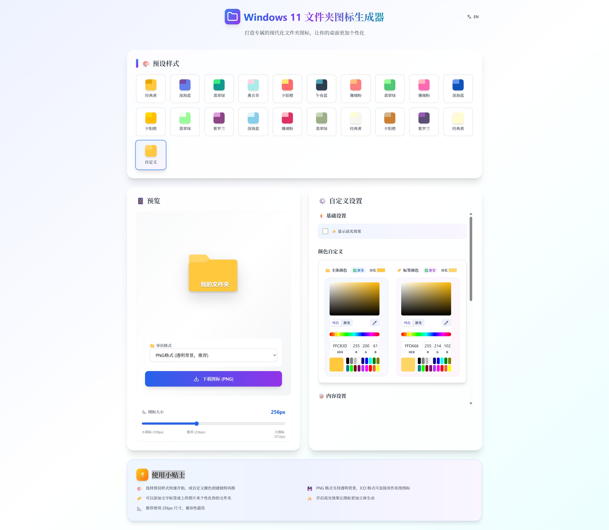

# Windows 11 文件夹图标生成器

[English](README_EN.md) | 中文

一个现代化的 Web 应用程序，用于创建和自定义 Windows 11 风格的文件夹图标。支持多种预设样式、自定义颜色、渐变效果和标签内容，可导出为 PNG 或 ICO 格式。

## 🌐 在线使用

**[立即使用 →](https://win11-folder-icon-generator.netlify.app/)**

无需安装，直接在浏览器中使用！

## 📸 预览截图




## ✨ 功能特性

### 🎨 样式定制
- **8种预设样式**：经典黄、深海蓝、翡翠绿、薰衣草、夕阳橙、午夜蓝、珊瑚粉、紫罗兰
- **自定义颜色**：文件夹主体和标签页颜色完全可控
- **渐变效果**：支持简易和高级渐变模式，包括线性和径向渐变
- **高光效果**：可开关的顶部高光效果，增强立体感（默认关闭）
- **智能吸附**：滑块在推荐尺寸（128px、256px、384px）自动吸附

### 📝 标签内容
- **文字标签**：支持自定义文字内容、颜色和字体
- **图片标签**：支持上传自定义图片作为标签
- **字体选择**：多种字体可选（Segoe UI、微软雅黑、苹方、Inter等）
- **智能定位**：文字和图片默认居中显示，提供最佳视觉效果
- **精确控制**：独立调节文字和图片的位置、大小（0-100%范围）
- **实时预览**：文字大小和位置调节即时反映

### 🔧 高级设置
- **渐变角度**：360度自由调节渐变方向
- **色彩调节**：色相、饱和度、亮度独立控制
- **三点渐变**：起始、中间、结束三个控制点精确控制
- **图标尺寸**：100px-512px连续可调，推荐256px
- **实时预览**：所有修改即时反映在预览中

### 💾 导出功能
- **PNG格式**：透明背景，适合一般使用
- **ICO格式**：自动优化的Windows系统图标格式
- **智能缩放**：自动检测内容边界并优化导出效果
- **多尺寸支持**：支持从100px到512px的任意尺寸导出

## 🚀 快速开始

### 环境要求
- Node.js 16.0 或更高版本
- npm 或 yarn 包管理器

### 安装步骤

1. **克隆项目**
```bash
git clone https://github.com/uiuibujor/win11-folder-icon-generator
cd win11-folder-icon-generator
```

2. **安装依赖**
```bash
npm install
```

3. **启动开发服务器**
```bash
npm run dev
```

4. **访问应用**
打开浏览器访问 `http://localhost:3000`

### 构建生产版本
```bash
npm run build
```

## 🛠️ 技术栈

- **前端框架**：React 18.2 + Hooks
- **构建工具**：Vite 5.0
- **样式框架**：Tailwind CSS 3.3
- **图标库**：Lucide React 0.294
- **颜色选择器**：react-best-gradient-color-picker 3.0
- **画布绘制**：HTML5 Canvas API
- **开发语言**：JavaScript (ES6+)

## 📖 使用指南

### 基础使用

1. **选择预设样式**
   - 在顶部样式面板中选择喜欢的预设样式
   - 或选择"自定义"进行个性化设置

2. **自定义颜色**
   - 调节文件夹主体和标签页的颜色
   - 使用渐变模式创建更丰富的视觉效果

3. **添加标签**
   - 选择文字或图片标签模式
   - 调整标签的位置、大小和样式

4. **导出图标**
   - 选择PNG或ICO格式
   - 点击下载按钮保存图标

### 高级功能

#### 渐变设置
- **简易模式**：快速调节整体色调
- **高级模式**：精确控制渐变的每个细节
  - 起始点颜色和位置
  - 中间点颜色和位置
  - 结束点颜色和位置

#### 图片标签
- 支持 JPG、PNG、GIF 等常见格式
- 自动缩放和居中
- 可调节透明度和位置

#### ICO导出优化
- 自动检测内容边界
- 智能居中和缩放
- 保持最佳视觉效果

## 🎯 项目结构

```
win11-folder-icon-generator/
├── src/
│   ├── components/        # React 组件
│   │   ├── ColorPickers.jsx
│   │   ├── ExportControls.jsx
│   │   ├── Preview.jsx
│   │   └── panels/        # 控制面板组件
│   │       ├── BasicSettings.jsx
│   │       ├── ColorControls.jsx
│   │       ├── IconSizeControl.jsx
│   │       └── LabelControls.jsx
│   ├── constants/         # 常量配置
│   │   ├── colorPickerLocales.js
│   │   └── presetStyles.js
│   ├── utils/             # 工具函数
│   │   ├── canvasDraw.js
│   │   ├── colors.js
│   │   ├── exportIcon.js
│   │   └── gradients.js
│   ├── App.jsx            # 主组件
│   ├── main.jsx           # 应用入口
│   └── index.css          # 全局样式
├── index.html             # HTML模板
├── package.json           # 项目配置
├── tailwind.config.js     # Tailwind配置
├── vite.config.js         # Vite配置
├── README.md              # 中文文档
└── README_EN.md           # 英文文档
```

## 🔧 配置说明

### Tailwind CSS
项目使用 Tailwind CSS 进行样式管理，配置文件位于 `tailwind.config.js`。

### Vite 配置
构建工具配置位于 `vite.config.js`，已优化用于 React 开发。

## 🤝 贡献指南

欢迎提交 Issue 和 Pull Request！

1. Fork 本项目
2. 创建特性分支 (`git checkout -b feature/AmazingFeature`)
3. 提交更改 (`git commit -m 'Add some AmazingFeature'`)
4. 推送到分支 (`git push origin feature/AmazingFeature`)
5. 开启 Pull Request

## 📝 更新日志

### v1.3.0 (最新)
- 🤖 加入AI功能
- 🎯 优化默认位置设置：图片和文字垂直位置默认调整为50%（居中）
- ⚡ 改进用户体验：新建标签时自动居中显示，更符合视觉习惯
- 🔧 统一默认值逻辑：确保重置功能和初始状态的一致性
- 🎨 提升视觉平衡：默认居中位置提供更好的视觉效果

### v1.2.0
- 🎯 修复滑块与推荐尺寸标注对齐问题
- ⚡ 高光效果默认关闭，提升性能
- 🎨 优化颜色选择器界面和交互
- 📐 改进图标尺寸控制的精确度
- 🔧 增强文字和图片位置调节功能

### v1.1.0
- 🎨 新增智能吸附功能
- 📝 改进标签控制面板
- 🔧 优化渐变效果算法
- 💾 增强ICO导出质量

### v1.0.0
- ✨ 初始版本发布
- 🎨 8种预设样式
- 🔧 完整的自定义功能
- 💾 PNG/ICO导出支持
- ⚡ 高光效果开关

## 📄 许可证

本项目采用 MIT 许可证 - 查看 [LICENSE](LICENSE) 文件了解详情。

## 🙏 致谢

- [React](https://reactjs.org/) - 用户界面库
- [Vite](https://vitejs.dev/) - 快速构建工具
- [Tailwind CSS](https://tailwindcss.com/) - CSS框架
- [Lucide](https://lucide.dev/) - 图标库

---

**享受创建属于你的个性化文件夹图标吧！** 🎉